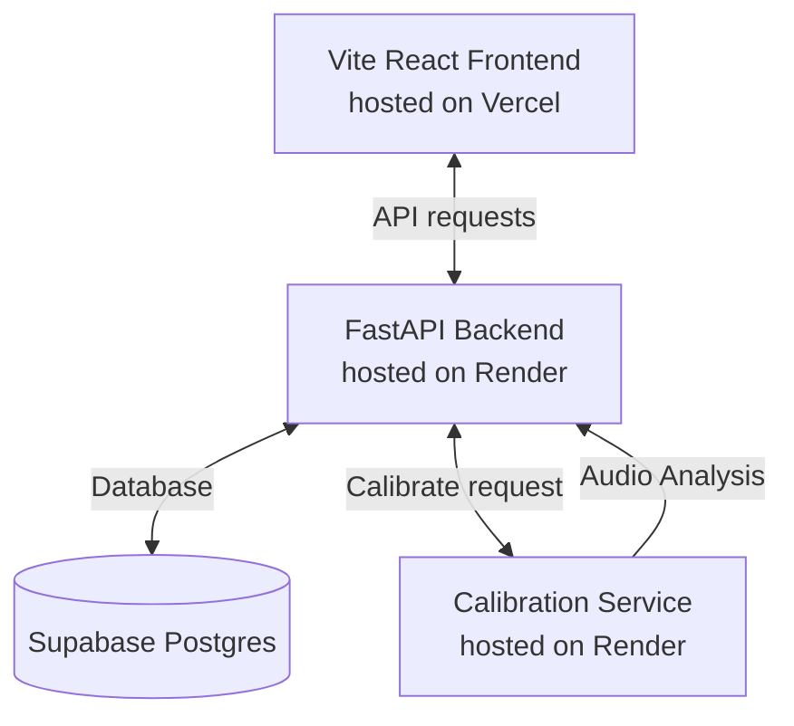

# MoodFlow — Hosting Setup Guide (Vercel & Render)

This guide provides step-by-step instructions to configure, deploy, and connect the frontend and backend services for MoodFlow on **Vercel** (frontend React SPA) and **Render** (FastAPI backend and Node.js calibration service).

---

## Architecture Overview

---

## 1. Supabase Database Setup

Ensure your Supabase schema is fully migrated.
- Go to the Supabase console, open your project, and run the SQL query from [supabase_schema.sql](file:///e:/1%20~%20SACHIN/NEW%20PROJECTS/MOODFLOW/supabase_schema.sql) in the SQL Editor.
- Note your **Project URL** and **API Keys** (specifically the `anon public` key and the `service_role` secret key).

---

## 2. Deploying Backend (FastAPI) on Render

1. Create a new account or log in to [Render](https://render.com).
2. Click **New +** and select **Web Service**.
3. Connect your Git repository.
4. Configure the Web Service settings:
   - **Name**: `moodflow-backend` (or a custom name)
   - **Root Directory**: `backend`
   - **Environment**: `Python3` (Render will read [runtime.txt](file:///e:/1%20~%20SACHIN/NEW%20PROJECTS/MOODFLOW/backend/runtime.txt) automatically to install Python 3.10.13)
   - **Build Command**: `pip install -r requirements.txt`
   - **Start Command**: `uvicorn main:app --host 0.0.0.0 --port $PORT`
5. Click **Advanced** and add the following **Environment Variables**:
   - `SUPABASE_URL`: Your Supabase URL (e.g. `https://yourproject.supabase.co`)
   - `SUPABASE_SERVICE_KEY`: Your Supabase service role API key (keep this secure!)
   - `FRONTEND_URL`: The URL of your Vercel deployment (e.g. `https://moodflow.vercel.app` or a comma-separated list of URLs if you want to support preview deploys).
6. Click **Create Web Service**. Note the URL generated (e.g., `https://moodflow-backend.onrender.com`).

---

## 3. Deploying Calibration Service on Render

1. On Render, click **New +** and select **Web Service**.
2. Connect your Git repository.
3. Configure the Web Service settings:
   - **Name**: `moodflow-calibration`
   - **Root Directory**: `calibration_service`
   - **Environment**: `Node`
   - **Build Command**: `npm install`
   - **Start Command**: `npm start`
4. Click **Advanced** and add the following **Environment Variables**:
   - `API_BASE_URL`: The URL of your FastAPI backend hosted on Render (from Step 2, e.g. `https://moodflow-backend.onrender.com`).
5. Click **Create Web Service**. Note the URL generated (e.g., `https://moodflow-calibration.onrender.com`).

---

## 4. Deploying Frontend (Vite React) on Vercel

1. Create a new account or log in to [Vercel](https://vercel.com).
2. Click **Add New** and select **Project**.
3. Connect your Git repository.
4. Configure the project settings:
   - **Root Directory**: `frontend` (Vercel will auto-detect Vite as the framework preset)
   - **Build Command**: `npm run build`
   - **Output Directory**: `dist`
5. Add the following **Environment Variables**:
   - `VITE_SUPABASE_URL`: Your Supabase URL.
   - `VITE_SUPABASE_ANON_KEY`: Your Supabase anon public API key.
   - `VITE_API_BASE_URL`: The URL of your FastAPI backend hosted on Render (e.g., `https://moodflow-backend.onrender.com`).
   - `VITE_CALIBRATION_SERVICE_URL`: The URL of your Calibration Service hosted on Render (e.g., `https://moodflow-calibration.onrender.com`).
6. Click **Deploy**. Note the URL generated (e.g., `https://moodflow.vercel.app`).
7. **Important**: Go back to your Render backend service, edit the `FRONTEND_URL` environment variable, and update it with the actual Vercel deployment URL to allow CORS requests to go through!

---

## 5. CI/CD and Maintenance

- **Automated Deployments**: Once connected to Git, Vercel and Render will automatically watch your production branch (e.g., `main`). Any push or merged pull request will trigger a rebuild and zero-downtime redeployment automatically.
- **Portability**: All server ports, databases, and cross-origins are configured dynamically through environment variables. If you migrate your hosting platform in the future, you only need to copy the variables without editing any source code!
